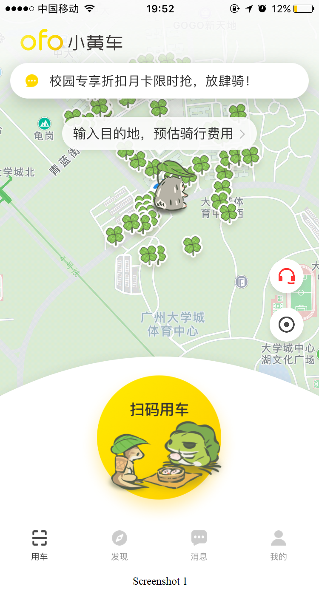
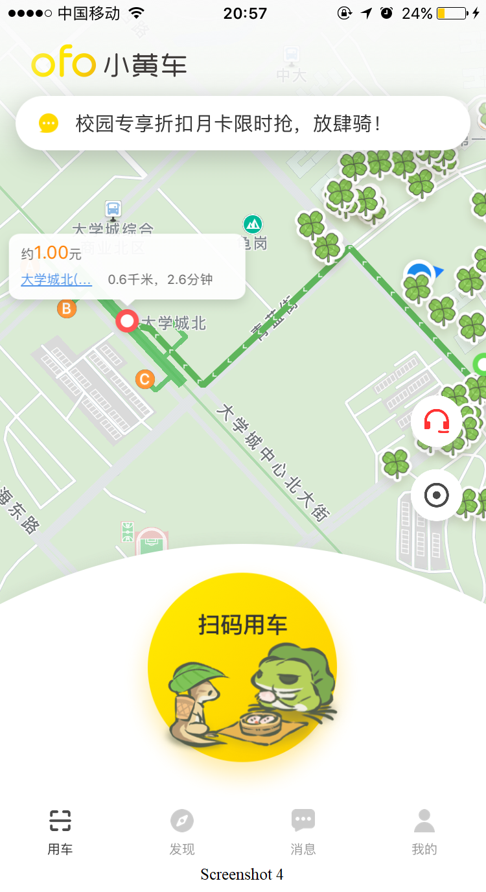
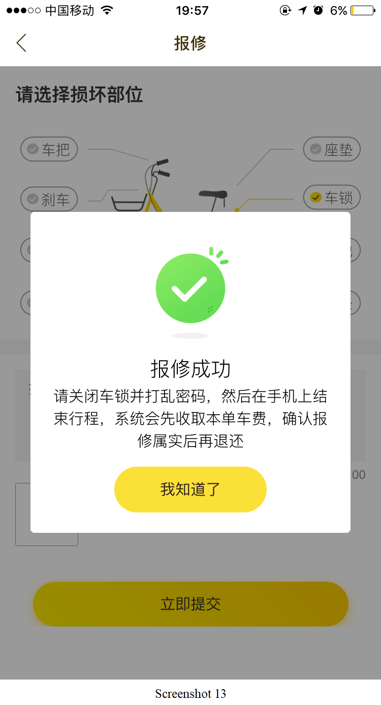

# ofo共享单车App用车业务描述

本文档是关于`ofo共享单车`App的用车业务的软件描述。

[ofo共享单车官网](http://www.ofo.so/#/)

ofo小黄车是一个无桩共享单车出行平台，缔造了“无桩单车共享”模式，致力于解决城市出行问题。用户只需在微信服务号或App输入车牌号，即可获得密码解锁用车，随取随用，随时随地，也可以共享自己的单车到ofo共享平台，获得所有ofo小黄车的终身免费使用权，以一换多。[ofo共享单车介绍](https://zh.wikipedia.org/wiki/Ofo%E5%B0%8F%E9%BB%84%E8%BD%A6)

## 首页

Screenshot 1是ofo共享单车App的**首页**，最下方有四个按钮：`用车`展示用车业务、`发现`展示ofo推出的活动、`消息`展示用户的消息与通知、`我的`展示个人信息页。本文档将对**用车业务**进行详细的软件描述。界面的上半部分是一个地图，展示了当前位置附近的单车情况。其中有一个对话框`输入目的地，预估骑行费用`，点击此对话框可以查询到达指定地点的路径以及预估骑行费用。界面下方有一个`扫码用车`的按钮，点击该按钮，将会进入扫码用车功能。

## 搜索

Screenshot 2是在点击`输入目的地，预估骑行费用`后所显示的**搜索界面**。该界面上方有一个搜索栏，用来输入目的地。点击搜索栏右方的`取消`，将会回到首页。

在Screenshot 2的搜索栏中输入目的地后，搜索栏下方将出现地点列表，为与搜索关键词相关的地点，如Screenshot 3所示。

点击地点列表中的某个地点之后，将会回到**首页**，同时，地图上将显示从当前位置到选择的目的地的推荐路线以及预计的价格、距离和时间信息。点击地图上的目的地链接，会返回到搜索界面。如Screenshot 4所示。

## 扫码

在点击首页的`扫码用车`按钮后，进入如Screenshot 5所示的**扫码界面**。**扫码界面**中间是一个二维码扫描框，对准车身的二维码，可以通过该二维码识别ofo单车。下面两个按钮：`手动输入车牌`和`手电筒`按钮。点击右上角的`X`符号后，将返回到首页。

## 手动输入车牌

点击`手动输入车牌`按钮后，将进入Screenshot 6-1所示的**手动输入车牌界面**。用户在`文本框`中输入车牌号，`立即用车`按钮将会被激活，如Screenshot 6-2所示。点击`立即用车`按钮，App将会通过车牌号来识别ofo单车。同时，该界面下方有三个按钮`手电筒`、`声音`和`扫码解锁`。点击`声音`按钮，App会在播放声音与静音状态中切换。点击`扫码解锁`后将会返回**扫码界面**。

点击**扫码界面**和**手动输入车牌界面**中的`手电筒`按钮，将会在摄像头照明功能的开启和关闭状态间切换。

在点击**手动输入车牌界面**的`立即用车`按钮后，如果车牌号输入错误，将会弹出一个对话框，提示车牌号不存在。如Screenshot 7所示。

## 解锁码界面

若点击`立即用车`按钮后，车牌号输入正确，或者在**扫码界面**下成功识别二维码，将会进入**解锁码界面**
，如Screenshot 8所示。该界面上半部分显示有和首页相同的地图。下半部分显示有对应车牌号的解锁。对于一个车牌号，每一次骑行的解锁码是随机生成的，并不是固定的。界面下方有四个按钮，分别是`手电筒`，`语音`，`结束行程`和`报修`。`手电筒`按钮的功能和**扫码界面**以及**手动输入车牌界面**的`手电筒`按钮相同。`语音`按钮和**扫码界面**以及**手动输入车牌界面**的`声音`按钮功能相同。`结束行程`和`报修`按钮的功能将会在后续段落介绍。

## 支付中

用户锁上车锁后，若App成功识别车辆已上锁，将会自动跳转到**支付界面**，如Screenshot 9所示。该界面上半部分显示有和首页相同的地图。下半部分显示本次骑行所需支付的费用。点击`费用明细`链接将会显示本次骑行的费用明细。最下方有一个`确认支付`按钮。

点击`确认支付`按钮后，将会进入支付流程。默认为通过余额支付。若余额不足，则会提示充值。

## 支付成功

成功支付后，将会进入**支付成功界面**，如Screenshot 10所示。该界面显示有本次骑行所支付的费用，以及一个本次骑行感受的反馈条。

## 手动结束行程

若在用户锁上车锁后，App没有成功识别车辆已上锁，用户可以点击**解锁码界面**的`结束行程`按钮，将会弹出如Screenshot 11所示的对话框。该对话框提示用户关闭车锁并打乱密码。有一个`确定结束行程`的按钮，点击该按钮后，将会跳转到**支付界面**。同时，有一个`继续骑行`的链接，点击该链接，将返回**解锁码界面**。

## 报修

点击**解锁码界面**的`报修`按钮，将会进入**报修界面**，如Screenshot 12-1所示。该界面提供有具体车辆损坏部位的选项，以及详细损坏信息描述的文本框，且支持插入照片。选择具体车辆损坏部位之后，`立即提交`按钮将被激活，如Screenshot 12-2所示。

点击`立即提交`按钮，系统将会提交报修信息。提交成功后，将会弹出一个对话框，提示报修成功，如Screenshot 13所示。点击`我知道了`按钮后，将会返回**解锁码界面**。

